# Entity-Relationship Diagram (ERD)

This document provides a visual representation of the database structure for the Survey Management System.

```mermaid
erDiagram
    User {
        int id PK
        string username
        string email
        string password_hash
        string role
        datetime created_at
        datetime updated_at
    }

    Survey {
        int id PK
        int user_id FK
        string title
        string description
        string status
        datetime start_date
        datetime end_date
        datetime created_at
        datetime updated_at
    }

    Question {
        int id PK
        int survey_id FK
        string question_text
        string question_type
        boolean is_required
        int order
        json options
        datetime created_at
        datetime updated_at
    }

    Response {
        int id PK
        int survey_id FK
        int user_id FK
        datetime submitted_at
        datetime created_at
        datetime updated_at
    }

    Answer {
        int id PK
        int response_id FK
        int question_id FK
        text answer_text
        datetime created_at
        datetime updated_at
    }

    SurveyParticipant {
        int id PK
        int survey_id FK
        int user_id FK
        string status
        datetime invited_at
        datetime responded_at
        datetime created_at
        datetime updated_at
    }

    SurveyAnalytics {
        int id PK
        int survey_id FK
        int total_responses
        int total_participants
        json response_rates
        json completion_rates
        datetime last_updated
    }

    User ||--o{ Survey : "creates"
    Survey ||--o{ Question : "contains"
    Survey ||--o{ Response : "receives"
    Response ||--o{ Answer : "contains"
    User ||--o{ Response : "submits"
    Survey ||--o{ SurveyParticipant : "has"
    User ||--o{ SurveyParticipant : "participates in"
    Survey ||--o| SurveyAnalytics : "has"

```

## Entity Descriptions

### User
- Represents system users (administrators, survey creators, respondents)
- Stores authentication and profile information
- Has a role-based access control system

### Survey
- Represents a survey form
- Contains metadata about the survey (title, description, dates)
- Has a status (draft, active, closed)
- Belongs to a user (creator)

### Question
- Represents individual questions within a survey
- Supports multiple question types (multiple choice, text, etc.)
- Has ordering and required/optional status
- Contains question-specific options in JSON format

### Response
- Represents a complete survey submission
- Links to both the survey and the responding user
- Contains submission timestamp

### Answer
- Represents individual answers to questions
- Links to both the response and the specific question
- Stores the actual answer content

### SurveyParticipant
- Manages survey participation and invitations
- Tracks response status for each participant
- Links users to surveys they're invited to

### SurveyAnalytics
- Stores aggregated analytics data for surveys
- Tracks response rates and completion statistics
- Updated periodically or on-demand

## Relationships

1. A User can create multiple Surveys (1:N)
2. A Survey can have multiple Questions (1:N)
3. A Survey can receive multiple Responses (1:N)
4. A Response can contain multiple Answers (1:N)
5. A User can submit multiple Responses (1:N)
6. A Survey can have multiple Participants (1:N)
7. A User can participate in multiple Surveys (M:N)
8. A Survey has one Analytics record (1:1)

## Notes

- All entities include `created_at` and `updated_at` timestamps
- Foreign keys are denoted with FK
- Primary keys are denoted with PK
- The diagram shows the core entities and their relationships
- Additional fields may exist in the actual implementation 