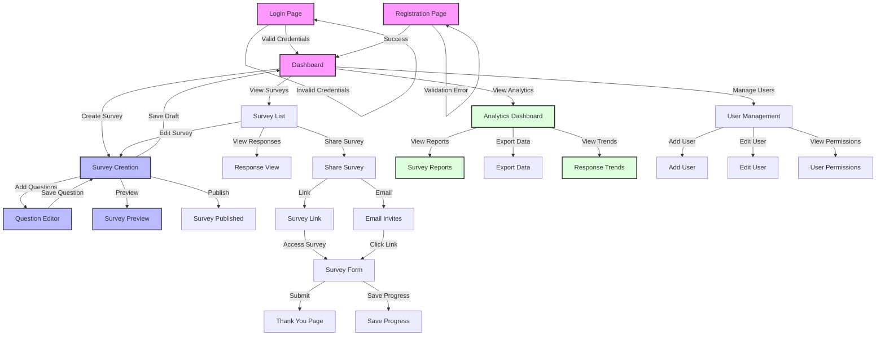

# UI/UX Flow Diagram

This document provides a visual representation of the main user flows and interactions in the Survey Management System.

## User Flow Descriptions

### Authentication Flow
1. Users start at the Login/Registration page
2. New users can register with email and password
3. Existing users can log in with credentials
4. Successful authentication leads to the Dashboard

### Dashboard Navigation
1. Central hub for all system functions
2. Quick access to:
   - Survey creation
   - Survey management
   - Analytics
   - User management

### Survey Creation Flow
1. Users can create new surveys
2. Add and edit questions with various types
3. Preview survey before publishing
4. Save as draft or publish immediately
5. Configure survey settings and permissions

### Survey Management Flow
1. View list of all surveys
2. Edit existing surveys
3. View and analyze responses
4. Share surveys via:
   - Email invitations
   - Direct links
   - Embed codes

### Response Flow
1. Participants access survey via link or email
2. Fill out survey questions
3. Save progress or submit complete survey
4. Receive confirmation/thank you message

### Analytics Flow
1. View comprehensive survey reports
2. Export data in various formats
3. Analyze response trends
4. Generate insights and statistics

### User Management Flow
1. Add new users to the system
2. Edit user information
3. Manage user permissions and roles
4. Track user activity

## Key Features

### Survey Creation
- Rich text editor for questions
- Multiple question types
- Question ordering and grouping
- Required/optional settings
- Preview functionality

### Survey Management
- Bulk actions
- Status tracking
- Response monitoring
- Sharing options
- Access control

### Analytics
- Real-time statistics
- Custom reports
- Data visualization
- Export capabilities
- Trend analysis

### User Experience
- Responsive design
- Intuitive navigation
- Progress saving
- Clear feedback
- Error handling

## Notes

- All flows include proper error handling and validation
- Users can save progress at any point
- System provides clear feedback for all actions
- Mobile-responsive design throughout
- Accessibility features implemented
- Consistent UI patterns across all flows 